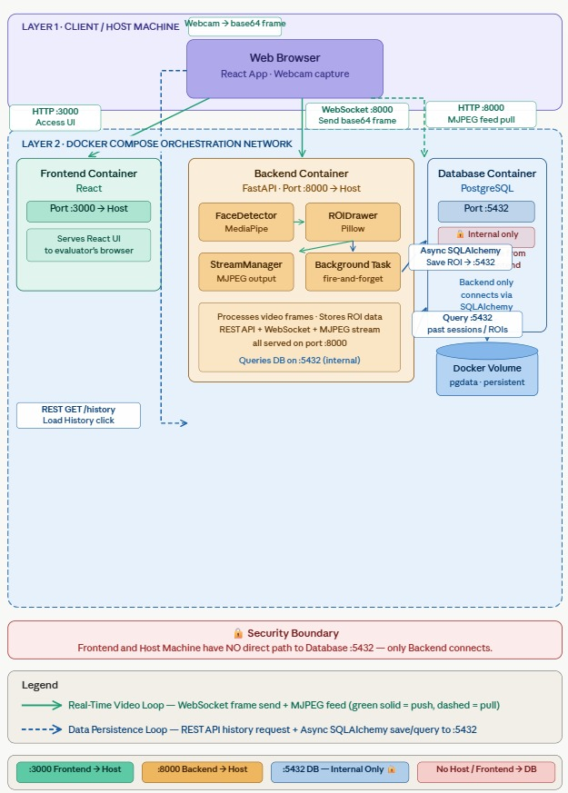

# 📷 Real-Time Face Detection API

A containerized, full-stack application that processes a real-time video feed via WebSockets, detects faces using MediaPipe, and draws minimal bounding boxes using Pillow. **This project strictly bypasses OpenCV for image manipulation.** Detection data is persisted in a PostgreSQL database and served to a React frontend.

---

## 📑 Table of Contents
1. [Tech Stack](#️-tech-stack)
2. [Part 1: Setup & Installation](#part-1-setup--installation)
3. [Part 2: Technical Documentation](#part-2-technical-documentation)
   - [Architecture Overview](#️-architecture-overview)
   - [Frontend & UI Features](#️-frontend--ui-features)
   - [Project Structure](#-project-structure)
   - [Database Schema](#️-database-schema)
   - [API Reference](#-api-reference)
   - [Testing](#-testing)
   - [AI Collaboration Attestation](#-ai-collaboration-attestation)
4. [Troubleshooting & Common Issues](#️-troubleshooting--common-issues)

---

## 🛠️ Tech Stack

| Layer | Technology |
|---|---|
| **Backend** | Python 3.11, FastAPI, MediaPipe, Pillow, SQLAlchemy (Asyncio), Pytest |
| **Frontend** | React.js 18, WebSockets |
| **Database** | PostgreSQL 16 |
| **Infrastructure** | Docker, Docker Compose |

---

## Part 1: Setup & Installation

### Prerequisites
- Docker and Docker Compose installed on your host machine.

### 1. Environment Configuration

Create a `.env` file in the root directory. The application adheres to a strict **"Fail-Fast"** principle and will not boot without these variables.

```env
# .env
POSTGRES_USER=app
POSTGRES_PASSWORD=changethis
POSTGRES_DB=facedetect
DATABASE_URL=postgresql+asyncpg://app:changethis@db:5432/facedetect

REACT_APP_API_URL=http://127.0.0.1:8000
REACT_APP_WS_URL=ws://127.0.0.1:8000
```

### 2. Build and Run

Spin up the entire stack (Database, Backend, and Frontend) in detached mode:

```bash
docker-compose up -d --build
```

### 3. Access the System

| Service | URL |
|---|---|
| Frontend UI | http://127.0.0.1:3000 |
| Backend API Docs (Swagger) | http://127.0.0.1:8000/docs |

### 4. Shutting Down

To gracefully stop the containers and free up ports (while preserving your database data in the Docker volume):

```bash
docker-compose down
```

---

## Part 2: Technical Documentation

## 🏗️ Architecture Overview

The system is designed for high-throughput, real-time video processing without dropping frames due to I/O bottlenecks.

1. **Ingest:** The React frontend captures webcam frames and sends them as base64-encoded JPEGs over a persistent WebSocket connection.
2. **Processing:** The FastAPI backend decodes the frame. MediaPipe calculates the tensor coordinates for the face, and Pillow draws the Region of Interest (ROI) bounding box.
3. **Persistence:** ROI coordinates are written to PostgreSQL via fire-and-forget `asyncio` background tasks, ensuring the video stream is never blocked by database latency.
4. **Delivery:** Annotated frames are pushed to a Singleton `StreamManager`, which broadcasts them to the frontend via an MJPEG HTTP stream.

### Architecture Diagram



---

## 🖥️ Frontend & UI Features

The frontend is built with React.js and features a clean, tabbed interface to separate real-time processing from historical analysis.

### 1. Live Feed Dashboard

- **Webcam Integration:** Captures raw video using the browser's `getUserMedia` API and draws to a hidden canvas for base64 extraction.
- **Real-Time Analytics:** Displays live FPS, active session duration, and the total number of detections in the current stream.
- **Live ROI Panel:** Surfaces the exact X/Y coordinates, width, height, and confidence percentage of the currently detected face, synchronized perfectly with the returning MJPEG feed.

### 2. Detection History (Master-Detail View)

Instead of simply dumping raw coordinates into a flat table, the history tab provides a structured, analytical view of past streaming events.

- **Session Summaries:** Displays top-level metrics for every historical session, including Duration, Total Detections, and Min/Max/Average Confidence.
- **Expandable Detail Rows:** Clicking on any session dynamically fetches and expands the specific frame-by-frame ROI log for that session.
- **Visual Status Indicators:** Employs color-coded confidence percentages (e.g., green for >80%, red for <60%) and active/ended session tags for immediate scannability.

---

## 📂 Project Structure

```plaintext
.
├── backend/
│   ├── app/
│   │   ├── detection/      # Core CV logic (MediaPipe & Pillow)
│   │   ├── routers/        # FastAPI endpoints (REST & WebSockets)
│   │   ├── services/       # Stream management & DB Repositories
│   │   ├── database.py     # Asyncpg connection engine
│   │   ├── main.py         # Application entry point & lifespan
│   │   ├── models.py       # SQLAlchemy ORM models
│   │   └── schemas.py      # Pydantic validation models
│   ├── tests/              # Pytest automated test suite
│   ├── Dockerfile
│   └── requirements.txt
├── frontend/
│   ├── src/
│   │   ├── components/     # React UI (VideoFeed, ROITable)
│   │   ├── hooks/          # Custom useWebSocket hook
│   │   └── App.js
│   ├── Dockerfile
│   └── package.json
├── diagram/
│   └── architecture.png    # System architecture diagram
├── docker-compose.yml
└── README.md
```

---

## 🗄️ Database Schema

The database uses a **Master-Detail relational architecture**.

### Table: `sessions`
Tracks individual streaming events. A session is initialized dynamically upon receipt of the first frame to prevent "ghost" sessions.

| Column | Type | Notes |
|---|---|---|
| `id` | UUID | Primary Key |
| `status` | String | e.g., `"active"`, `"ended"` |

### Table: `regions_of_interest`
Stores individual frame detection data. Linked to `sessions` via `ondelete="CASCADE"`.

| Column | Type | Notes |
|---|---|---|
| `id` | BigInteger | Primary Key |
| `session_id` | UUID | Foreign Key → `sessions.id` |
| `frame_number` | Integer | |
| `detection_timestamp` | TIMESTAMP | Defaults to `func.now()` |
| `x`, `y` | Integer | `>= 0` |
| `width`, `height` | Integer | `> 0` |
| `confidence` | Float | `0.0 – 1.0` |

---

## 🔌 API Reference

### 1. WebSocket Ingest Stream

**URL:** `ws://127.0.0.1:8000/ws/stream`

**Flow:** Browser sends a frame → Server processes, saves to DB, updates MJPEG stream → Server sends ACK → Browser sends next frame.

**Incoming Message (Browser → Server):**
```json
{ "frame": "<base64_encoded_jpeg_string>" }
```

**Outgoing ACK (Server → Browser):**
```json
{
  "ack": true,
  "roi": { "x": 120, "y": 80, "width": 200, "height": 200, "confidence": 0.95 }
}
```

---

### 2. Live Video Feed (MJPEG)

**`GET /api/feed`**

| Field | Value |
|---|---|
| Response Type | `multipart/x-mixed-replace; boundary=frame` |
| Description | A continuous stream of JPEG bytes representing the annotated video feed. |

---

### 3. Fetch Detection History

**`GET /api/roi`**

**Query Parameters:**

| Parameter | Type | Default | Notes |
|---|---|---|---|
| `session_id` | UUID | — | Optional |
| `min_confidence` | Float | — | Optional, `0.0 – 1.0` |
| `limit` | Int | `50` | |
| `offset` | Int | `0` | |

**Response:**
```json
{
  "total": 142,
  "limit": 50,
  "offset": 0,
  "data": [
    {
      "id": 1,
      "session_id": "uuid-string",
      "frame_number": 1,
      "x": 120, "y": 80, "width": 200, "height": 200,
      "confidence": 0.95,
      "detection_timestamp": "2024-05-03T10:40:17Z"
    }
  ]
}
```

---

### 4. Fetch Session Summaries

**`GET /api/sessions`**

Returns all historical sessions with aggregated ROI metrics via a SQL `OUTER JOIN`.

**Response:**
```json
[
  {
    "id": "uuid-string",
    "status": "ended",
    "detection_count": 450,
    "avg_confidence": 0.88,
    "min_confidence": 0.65,
    "max_confidence": 0.99,
    "started_at": "2024-05-03T10:30:00Z",
    "ended_at": "2024-05-03T10:35:00Z",
    "duration_seconds": 300.0
  }
]
```

---

## 🧪 Testing

The system includes an automated Pytest suite that validates API contracts and core business logic.

**To run the tests inside the active backend container:**
```bash
docker-compose exec backend pytest
```

**Coverage Highlights:**

- **Integration Tests (`test_api.py`):** Validates FastAPI routing and Pydantic validation constraints (e.g., ensuring the `/api/roi` endpoint correctly rejects out-of-bounds confidence values with a `422 Unprocessable Entity`).
- **Unit Tests (`test_detection.py`):** Tests the pure Python image processing logic (`ROIDrawer`), ensuring the Pillow manipulation executes safely without mutating the original source image array.

---

## 🤖 AI Collaboration Attestation

In accordance with the assessment guidelines, AI assistants were used during development. Here is an honest breakdown of what was AI-assisted vs. what was independently decided:

### What AI Was Used For
- Generating boilerplate code: MediaPipe tensor processing scaffolding, Pytest fixtures, and the initial Docker Compose structure.
- Drafting repetitive or formulaic sections of this README.
- A small amount of assistance in validating whether certain architectural decisions were on the right track (e.g., confirming that using `asyncio` background tasks for DB writes was a sound approach for non-blocking I/O).

### What Was My Own Work
All core architectural decisions were made independently:

- **Choosing `asyncio` background tasks for DB writes** — to decouple video processing latency from database I/O.
- **Designing the Singleton `StreamManager`** — to broadcast annotated frames via MJPEG without per-request overhead.
- **Clamping bounding box coordinates** — to prevent out-of-bounds Pillow crashes when MediaPipe detects faces near frame edges.
- **Lazy session initialization** — initializing a DB session only on the first received frame to avoid ghost sessions.
- **The Master-Detail schema design** — structuring `sessions` and `regions_of_interest` with a CASCADE foreign key for clean data lifecycle management.

AI was used as a productivity tool and occasional sounding board — the design choices, trade-offs, and implementation decisions are my own.

---

## ⚠️ Troubleshooting & Common Issues

| Symptom | Cause & Fix |
|---|---|
| **"No stream active" / Camera fails to start** | Ensure your browser has been granted webcam permission. If running on `127.0.0.1` instead of `localhost`, some strict browsers require you to explicitly allow camera access for non-HTTPS local IPs. |
| **Port conflicts on 8000 or 3000** | Ensure no other local development servers are occupying port `8000` (backend) or `3000` (frontend) before running `docker-compose up`. |
| **Database connection errors / backend crashes on boot** | The backend enforces a strict Fail-Fast policy. Double-check that your `.env` file is correctly configured and located in the root directory of the project. |
